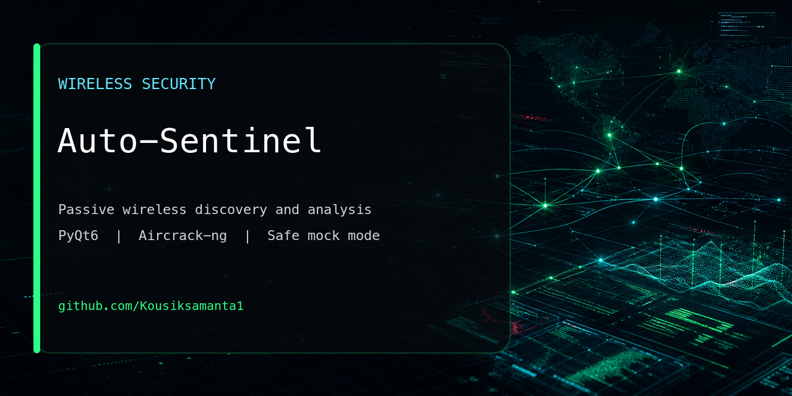
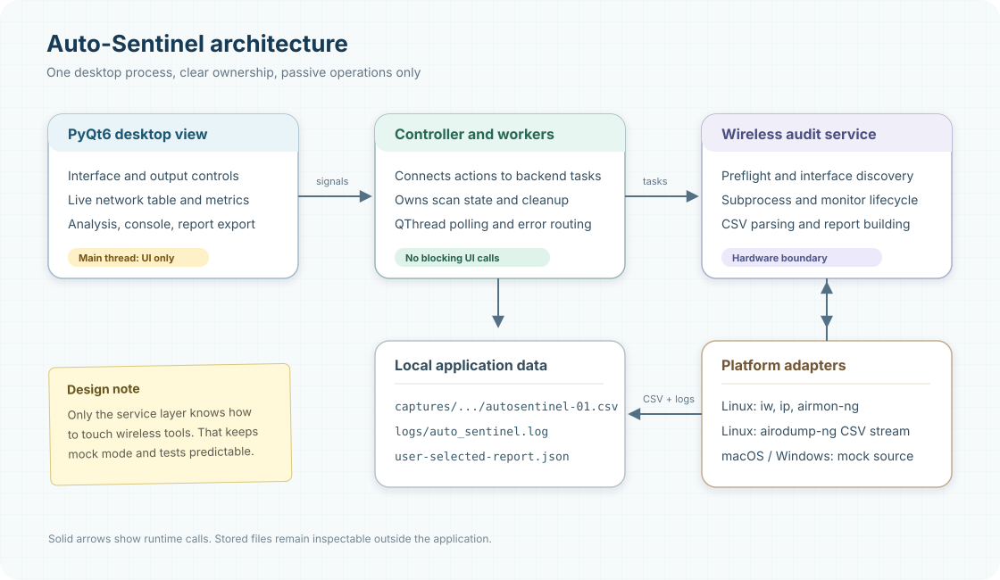
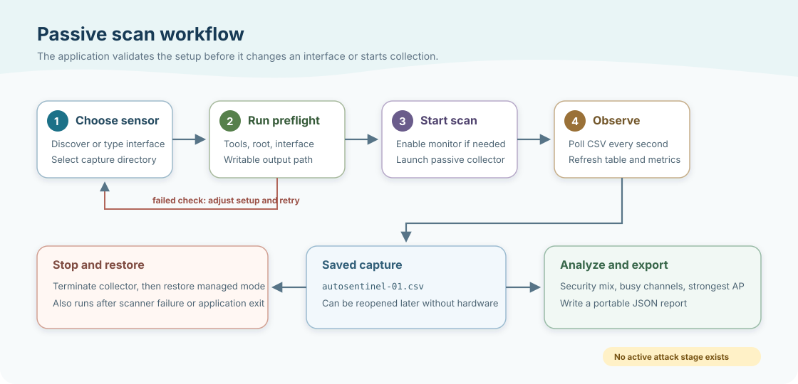

<p align="center">
  
</p>

# Auto-Sentinel

[](https://github.com/Kousiksamanta1/Auto-Sentinel/actions/workflows/ci.yml)
[](https://www.python.org/)
[](LICENSE)
[](https://kousiksamanta1.github.io/PORTFOLIO/)

Auto-Sentinel is a production-ready Python desktop application for **passive**
wireless discovery and security analysis. It combines a PyQt6 dashboard with
`airmon-ng` and `airodump-ng` on Linux, while providing a fully functional mock
runtime on macOS and Windows.

## Features

- Dynamic wireless-interface discovery with manual override
- Structured preflight checks for tools, privileges, interface, and output path
- Threaded scans and parsing so the GUI remains responsive
- Live SSID, BSSID, channel, signal, and security telemetry
- Configurable capture directory
- Persistent airodump-compatible CSV output in mock and hardware modes
- Loading and analysis of existing airodump-ng CSV captures
- JSON report export
- Rotating application logs
- Managed-mode restoration after scans and during shutdown
- Automated unit and offscreen GUI tests
- Installable command-line entry point and GitHub Actions CI

## Runtime Modes

| Platform | Mode | Behavior |
| --- | --- | --- |
| Linux/Kali | Hardware | Passive scanning through aircrack-ng tools |
| macOS | Mock | Synthetic networks with real CSV/report workflows |
| Windows | Mock | Synthetic networks with real CSV/report workflows |

Auto-Sentinel intentionally does not execute deauthentication or automate
handshake attacks. Its supported scope is passive discovery, capture parsing,
analysis, and reporting.

## Requirements

- Python 3.10 or newer
- PyQt6 6.7 or newer
- Linux hardware mode: `aircrack-ng`, `iproute2`, and a monitor-mode-capable
  wireless adapter

## How It Fits Together

The desktop window stays focused on interaction while the controller owns
threading and scan state. Platform commands and capture parsing remain inside
the backend service.



The scan path is deliberately linear: validate first, collect passively, then
analyze or export the saved data.



## Quick Start

```bash
git clone https://github.com/Kousiksamanta1/Auto-Sentinel.git
cd Auto-Sentinel
python3 -m venv .venv
source .venv/bin/activate
python -m pip install --upgrade pip
python -m pip install -e .
auto-sentinel
```

You can also run the source entry point:

```bash
python main.py
```

### Windows Activation

```powershell
py -3 -m venv .venv
.\.venv\Scripts\Activate.ps1
python -m pip install --upgrade pip
python -m pip install -e .
auto-sentinel
```

If PowerShell blocks activation:

```powershell
Set-ExecutionPolicy -Scope CurrentUser -ExecutionPolicy RemoteSigned
```

## Kali/Linux Setup

Install the required system tools:

```bash
sudo apt update
sudo apt install -y python3 python3-venv python3-pip aircrack-ng iproute2
```

Create the environment and install Auto-Sentinel:

```bash
python3 -m venv .venv
source .venv/bin/activate
python -m pip install --upgrade pip
python -m pip install -e .
```

Start hardware mode with the privileges required for monitor interfaces:

```bash
sudo .venv/bin/auto-sentinel
```

## Using the Application

1. Click **Refresh Interfaces** or enter the interface name manually.
2. Choose **Monitor** when Auto-Sentinel should enable monitor mode.
3. Select a writable **Capture Directory**.
4. Click **Run Preflight Checks** and resolve any failed required checks.
5. Click **Start Network Scan**.
6. Review live networks in the dashboard.
7. Click **Analyze Current Results** for a security and channel summary.
8. Click **Export JSON Report** to save the current dataset.
9. Stop the scan before changing interface configuration.

To analyze an existing capture, enter or select an airodump-ng `.csv` file and
click **Load Capture CSV**.

## Output

Each scan creates:

```text
captures/
└── scan_YYYYMMDD_HHMMSS_microseconds/
    └── autosentinel-01.csv
```

Runtime logs are written to:

```text
logs/auto_sentinel.log
```

Exported JSON reports include generation time, analytical summary, and all
displayed network records.

## Development

Install development tooling:

```bash
python -m pip install -e ".[dev]"
```

Run all checks:

```bash
make check
```

Or run them separately:

```bash
ruff check .
QT_QPA_PLATFORM=offscreen python -m unittest discover -s tests -v
python -m coverage run -m unittest discover -s tests -v
python -m coverage report
```

## Project Layout

```text
Auto-Sentinel/
├── main.py
├── pyproject.toml
├── docs/
│   ├── architecture.svg
│   └── passive-workflow.svg
├── core/
│   ├── controller.py
│   ├── environment.py
│   ├── logic.py
│   ├── logging_config.py
│   ├── models.py
│   ├── parsers.py
│   └── version.py
├── ui/
│   ├── main_window.py
│   ├── styles.py
│   └── workers.py
└── tests/
```

## Troubleshooting

### Preflight reports missing tools

```bash
sudo apt install -y aircrack-ng iproute2
```

### No wireless interfaces are detected

Confirm the adapter is visible and supports monitor mode:

```bash
iw dev
ip link
```

The interface field remains editable for adapters not reported by discovery.

### Permission failure

Hardware scans generally require elevated privileges:

```bash
sudo .venv/bin/auto-sentinel
```

### Interface remains in monitor mode

Auto-Sentinel restores interfaces it changed itself. Manual recovery:

```bash
sudo airmon-ng stop wlan0mon
sudo ip link set wlan0 up
```

Adjust names for your adapter.

### Qt fails to start on macOS from an iCloud folder

The entry point automatically copies Qt plugins to a temporary local directory.
Always launch through `python main.py` or the `auto-sentinel` command so this
bootstrap runs.

## Safety and Authorization

Use Auto-Sentinel only on networks and systems you own or are explicitly
authorized to assess. Passive collection can still expose sensitive network
metadata; protect capture files and reports accordingly.

## Contributing

Focused bug reports, documentation improvements, and tested enhancements are
welcome. Read [CONTRIBUTING.md](CONTRIBUTING.md) before opening a pull request.

## License

MIT. See [LICENSE](LICENSE).
